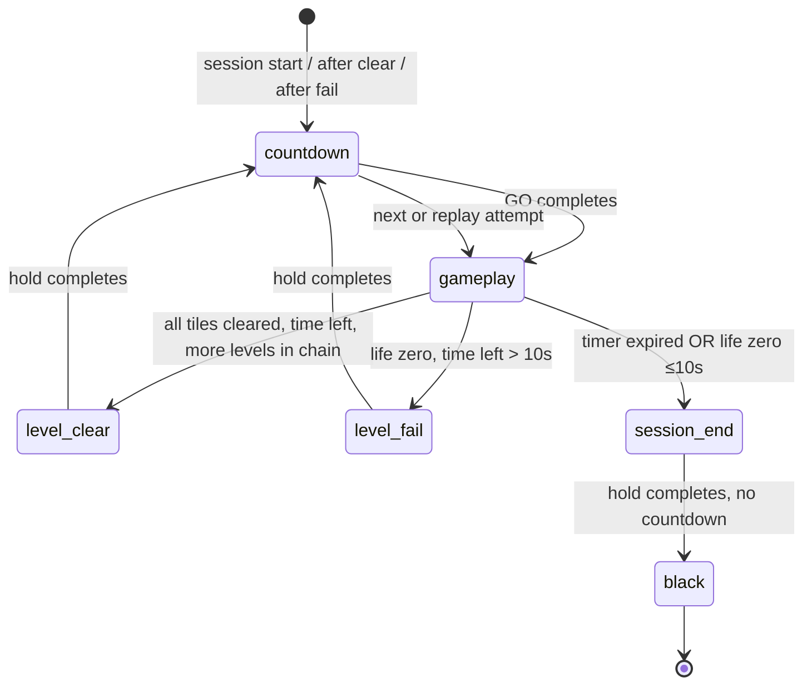

# LED Climb — effects implementation plan

Implementation plan for audio, countdown, level transitions, and LED wall behavior per:

- [Locked decisions](../../docs/game-effects/LOCKED_DECISIONS.md) — **authoritative**
- [Global rules](../../docs/game-effects/GLOBAL_RULES.md)
- [Climb effects spec](./EFFECTS_SPEC.md)
- [Effects flow diagram](./assets/climb-effects-flows.png)

**Status:** Plan reviewed — ready for implementation (see review section).

---

## Plan review (2026-08-07)

**Verdict:** **Ready** for parallel implementation after the revisions below (no blocking spec/code conflicts found).

### Top findings

| # | Severity | Finding | Plan change |
|---|----------|---------|-------------|
| 1 | **Blocker (fixed)** | Marathon loop ends with immediate `_hw_blank_floor` — no clear panel on **last level cleared**, **pre-level timeout break**, or **normal loop exit**. | Added `_run_session_end()` helper; all terminal paths call it before `black`. |
| 2 | **Blocker (fixed)** | Pseudocode used `await_hold(2.5)` **and** `.led` `end_time_sec ≥ 2.5` — double hold, drift risk. | `.led` timeline is the single hold authority; stinger fires once at phase entry (concurrent). |
| 3 | **High (fixed)** | Static effect groups (`speed=0`) lose cells when `floor_layout_coors_no_use` is set (see `level_scaler.py` L378–379). | `EffectRunner` passes `floor_layout_coors_no_use=()` on prepare. |
| 4 | **High (fixed)** | Life-restart path refills HP **before** fail/countdown in current code (L1755–1760); effects must run **first**. | Fail → stinger/hold → countdown → refill HP → replay. |
| 5 | **Medium (noted)** | [EFFECTS_SPEC.md](./EFFECTS_SPEC.md) L98–104 — level-fail copy sits under **Timer expire**; missing `## Level fail` heading. | Added doc task D7; implementation follows diagram + global rules. |
| 6 | **Medium (resolved)** | Pre-session `CountdownScreen` plus backend countdown on level 1. | **Locked:** both UI + floor countdown run; keep ~in sync via `phase` / `phase_step` (see [LOCKED_DECISIONS.md](../../docs/game-effects/LOCKED_DECISIONS.md) #4). |
| 7 | **Low (verified)** | Code audit line refs, 6×33 layout, diagram three-wall countdown, and `_load_level_file` / `_run_level_attempt` reuse — all match repo. | No change. |

### Locked product decisions (2026-08-07)

All items below are **locked** in [LOCKED_DECISIONS.md](../../docs/game-effects/LOCKED_DECISIONS.md). This plan must not contradict them.

| # | Topic | Locked decision |
|---|-------|-----------------|
| 1 | Effects directory | `games/source/effects/` |
| 2 | Effect files (exactly three) | `countdown.led`, `level_clear.led`, `level_fail.led` |
| 3 | UI + floor countdown | **Both run**; keep approximately in sync (floor from backend `.led`; UI countdown stays) |
| 4 | Transition stinger | **One shared** `games/audio/transition_stinger.mp3` for clear **and** fail (MVP) |
| 5 | Audio helper | Per-game `api/audio_manager.py`, class `AudioManager` — non-blocking (no game-thread waits) |
| 6 | Phase fields | On `/game-state`: at least `phase` + `accepting_input` (Climb frontend sync only; **no RFID changes**) |
| 7 | Life=0 with ≤10 s left | **Session end:** `level_clear.led` → stinger → black; no fail panel; no countdown |
| 8 | Last level cleared | **Session end:** `level_clear.led` → stinger → black; no countdown |
| 9 | Timer expire | **Session end:** `level_clear.led` → stinger → black; no countdown |
| 10 | Score SFX | Backend authoritative; mute frontend synth when backend audio active |

---

## Locked decisions (Climb-specific)

| # | Decision |
|---|----------|
| 1 | **`.led` mini-levels** for countdown / clear / fail — loaded and played through the **same** `_load_level_file` → `prepare_level_for_platform` → `Play.running()` path as gameplay; wired into the marathon loop. |
| 2 | **Native 6×33 effect authoring** — effect `.led` archives authored at **6×33** (not 6×24) so digit glyphs and wall fills are not distorted by 24→33 scaling. |
| 3 | **Countdown every level start** — three-wall pattern: green digits on center wall, blue side panels shifting per spec/diagram. |
| 4 | **Dual countdown** — backend `countdown.led` drives floor LEDs; UI overlay follows `phase` / `phase_step` (~sync, not duplicate timers). |

EffectRunner must call `_prepare_level_attempt` (or equivalent) with **`floor_layout_coors_no_use=()`** so static groups are not stripped at platform edges.

### Session flow (locked)

```
Every level start:
  play(countdown.led) + UI countdown (~sync) → play(gameplay) + BGM

Lives = 0 and >10 s left:
  stop BGM → play(level_fail.led) + stinger → play(countdown.led) → restart same level

Lives = 0 and ≤10 s left:
  stop BGM → play(level_clear.led) + stinger → black → session end

Level cleared (more levels remain):
  stop BGM → play(level_clear.led) + stinger → play(countdown.led) → next level

Timer expire OR last level cleared:
  stop BGM → play(level_clear.led) + stinger → black → session end
```

---

## Executive summary

Headless Climb today runs a 5-minute **marathon** (`level_sequence` → `Play.running()` per level) with **no** interstitial effects: no per-level countdown, no clear/fail panels, no transition stingers, and no BGM policy. The React UI runs a **one-shot** pre-session countdown before `POST /start-game`, which does not repeat after level clear or fail.

This plan adds three authored **6×33 `.led` effect archives** under `games/source/effects/` (`countdown.led`, `level_clear.led`, `level_fail.led`), a small **`EffectRunner`** wrapper around the existing level-attempt pipeline, a **session phase state machine** in `game_manager.py`, **`AudioManager`** (non-blocking server thread + frontend Web Audio sync), and tests that lock timing, matrix coverage, and marathon wiring.

---

## Wall layout reference (6×33)

From [EFFECTS_SPEC.md](./EFFECTS_SPEC.md) and [GRID_MATRICES.md](../../docs/game-effects/GRID_MATRICES.md):

| Section | Size | Global column range |
|---------|------|---------------------|
| Left wall | 6×13 | 0–12 |
| Center wall | 6×7 | 13–19 |
| Right wall | 6×13 | 20–32 |

| Color | RGB (authoring) | Meaning |
|-------|-----------------|---------|
| Blue | `(0, 0, 254)` | Wall / background ON |
| Green | `(0, 254, 0)` | Countdown digit / “GO” |
| Red | `(254, 0, 0)` | Level fail |
| Off | `(0, 0, 0)` | LEDs off |

Row 0 = top, col 0 = left. Effects `.led` files should be authored at **native 6×33** so digit glyphs are not distorted by 24→33 scaling.

---

## Code audit (current state)

### 1. Marathon loop — no effect hooks

The session loop loads gameplay levels and calls `Play.running()` directly. There is no branch for countdown, clear, fail, or session-end sequences:

```1693:1766:led-climb/api/game_manager.py
                play.callback = _frame_callback
                for lvl_path in game.level_sequence:
                    if game._session_over or not game.running:
                        break
                    session_elapsed = time.time() - game.session_start
                    if session_elapsed > game.game_time_sec:
                        game._session_over = True
                        game._end_reason = "timeout"
                        break

                    lvl_id = os.path.basename(lvl_path).rsplit(".", 1)[0]

                    # ── RESTART LOOP: replay this level whenever lives hit 0 with
                    #    >10s left (score persists, HP refills). Exits on level
                    #    clear, session timeout, or true game-over (life=0, <10s).
                    while True:
                        ...
                            _run_level_attempt(
                                lvl_path,
                                ...
                                play_consumer=_play_level,
                            )
                        ...
                        if game._restart_level:
                            game.life = game.max_life
                            ...
                            continue

                        if game._level_cleared:
                            game.levels_cleared += 1
                            ...
                        break
```

**Gap:** After `_level_cleared` or `_restart_level`, the loop immediately reloads gameplay with no clear/fail panel, stinger, or countdown.

### 2. Session-end paths — immediate blank, no clear panel

Timer and life exhaustion set `_session_over` inside the gameplay frame callback; the loop then blanks hardware with no transition:

```1347:1360:led-climb/api/game_manager.py
                        if game.life <= 0:
                            ...
                                game._restart_level = True
                                return False
                            game._session_over = True
                            ...
                            return False
                        if (not game.running) or session_elapsed > game.game_time_sec:
                            game._session_over = True
                            game.update_state(game_over_reason="timeout", result=2)
                            return False
```

```1792:1799:led-climb/api/game_manager.py
                game.update_state(game_over=True, time_left=0,
                                  game_over_reason=final_reason, result=final_result,
                                  ...)
                game.running = False
                _hw_blank_floor(led_table)
```

**Gap:** Locked rule requires **clear-blue hold → stinger → black** on timer expire; today it jumps straight to `_hw_blank_floor`.

### 3. `.led` load path — reusable for effect mini-levels

`_load_level_file` already unzips archives, prefers `play_order=False` gameplay shelves, and returns `(dict_group, game_obj)`:

```467:499:led-climb/api/game_manager.py
def _load_level_file(path):
    """Load one .led/.ledb: unzip, find the main gameplay shelve (the one with
    play_order=False; audio/anim dirs have play_order=True), return
    (dict_group, game_obj) as in-memory objects. (None, None) on failure."""
    ...
                    if not getattr(go, "play_order", True):
                        return dg, go          # main gameplay — done
```

`_run_level_attempt` composes load → reset → prepare → setup → play:

```334:365:led-climb/api/game_manager.py
def _run_level_attempt(
    path,
    *,
    led_table,
    settings,
    level_id,
    setup_consumer,
    play_consumer,
    reset_consumer=None,
):
    groups, game = _load_level_file(path)
    ...
    groups, game = _prepare_level_attempt(...)
    setup_consumer(groups, game)
    play_consumer(groups)
    return groups, game
```

**Opportunity:** Effect mini-levels ride this exact pipeline; effect runner supplies a lightweight callback (no scoring / no marathon advance).

### 4. Level scaling — gameplay 6×24→6×33; effects should skip upscale

Platform defaults and scaler target **6×33**:

```197:198:led-climb/api/game_manager.py
    "grid_rows": 6,            # value_high  — Climb is 6 rows
    "grid_cols": 33,           # value_width — Climb is 33 cols (SQUARE grid)
```

```268:396:led-climb/api/level_scaler.py
def prepare_level_for_platform(..., target_rows, target_cols, ...):
    ...
    prepared_game.row = target_rows
    prepared_game.col = target_cols
```

Authored gameplay levels are **6×24** ([LEVEL_SCALING.md](./LEVEL_SCALING.md)). Effect `.led` files should be **authored at 6×33**; `prepare_level_for_platform` with matching source/target dimensions is a no-op upscale.

### 5. Display path — floor matrix only; wall arrays unused headless

Frame callback builds `led_display` from floor `cell_win` map and pushes to API / hardware. `HeadlessLedTable` wall arrays exist but are not merged into published frames:

```1576:1591:led-climb/api/game_manager.py
                        led_display = [[0, 0, 0] for _ in range(rows * cols)]
                        for (ci, cj), (rank, cat, mc) in cell_win.items():
                            idx = ci * cols + cj
                            ...
                            led_display[idx] = [int(mc[0]), int(mc[1]), int(mc[2])]
```

Climb “three walls” are **regions of the 6×33 floor matrix**, not separate `wall_light` 1D arrays — consistent with [EFFECTS_SPEC.md](./EFFECTS_SPEC.md).

### 6. Frontend countdown — pre-session only, not synced to floor

`App.jsx` shows `CountdownScreen` once after login, **before** `SimulatorScreen` starts the API game:

```106:118:led-climb/frontend/src/App.jsx
  const handleLogin = (...) => {
    ...
    setScreen(S.COUNTDOWN)
  }
```

```169:177:led-climb/frontend/src/App.jsx
      {screen === S.COUNTDOWN && (
        <CountdownScreen config={gameConfig} onDone={() => setScreen(S.SIMULATOR)} />
      )}
      {screen === S.SIMULATOR && (
        <SimulatorScreen config={gameConfig} onGameEnd={handleGameEnd} />
      )}
```

`CountdownScreen` uses local 1 Hz Web Audio beeps — independent of backend LED state:

```25:41:led-climb/frontend/src/screens/CountdownScreen.jsx
  useEffect(() => {
    beep(523, 180)
    const id = setInterval(() => {
      setN(prev => {
        const next = prev - 1
        if (next <= 0) {
          clearInterval(id)
          beep(880, 350)              // GO!
          setTimeout(onDone, 600)
          return 0
        }
        beep(523, 180)
        return next
      })
    }, 1000)
```

**Gap:** Per-level countdown must be **backend-driven** (`.led` on floor + shared phase/tick in game state). UI countdown **stays** and follows backend `phase` / `phase_step` for ~sync (locked decision #4).

### 7. Audio — mocked server-side; frontend synth only

Headless startup mocks `pygame` / `audio_play`:

```73:77:led-climb/api/game_manager.py
    'pygame': MagicMock(),
    'pygame.mixer': MagicMock(),
    'audio_play': MagicMock(),
```

`SimulatorScreen` plays press/hurt synth beeps only — **no BGM, stinger, or countdown tick assets**:

```29:54:led-climb/frontend/src/screens/SimulatorScreen.jsx
  // Audio: synth beeps via Web Audio (no asset files needed)
  ...
  const playPress = () => beep(660, 70, 'triangle', 0.12)
  const playHurt = () => beep(140, 220, 'sawtooth', 0.22)
```

Legacy `audio_play/audio.py` exposes blocking-ish `mixer.music` APIs — unsuitable for the game thread as-is:

```24:29:led-climb/games/audio_play/audio.py
    def play(self, audio_name):
        try:
            mixer.find_channel(True, **('force',)).play(mixer.Sound(audio_name))
        except:
            pass
```

### 8. Life-restart vs level-fail semantics

When `life <= 0` but **>10 s** session time remains, the callback sets `_restart_level` (same level replay, HP refill) — this is the **level-fail restart** path requiring fail panel + countdown:

```1347:1353:led-climb/api/game_manager.py
                        if game.life <= 0:
                            time_left = game.game_time_sec - session_elapsed
                            if time_left > 10.0:
                                game._restart_level = True
                                return False
```

When `life <= 0` and **≤10 s** remain, session ends (`result=0`) — **session end** path: `level_clear.led` → stinger → black; **no fail panel**, no countdown.

### 9. Spec doc note

[EFFECTS_SPEC.md](./EFFECTS_SPEC.md) lines 98–104 (“All three walls → solid red…”) appear under the **Timer expire** heading but describe **level fail** — the `## Level fail` heading is missing. Implementation follows the diagram + locked decisions; fix the spec heading in task D7.

### 10. Session exit — no interstitial today

When the marathon loop finishes (last level cleared, timeout at loop head, or `_session_over` from gameplay), the code jumps straight to `_hw_blank_floor` with no clear panel:

```1771:1799:led-climb/api/game_manager.py
                # Session finished (timer/lives/sequence end).
                game._session_over = True
                ...
                game.running = False
                _hw_blank_floor(led_table)
```

**Gap:** All session-end paths (timeout, out-of-life ≤10 s, last level cleared, sequence exhausted) need **`level_clear.led` → stinger → black** before this blank.

---

## Target architecture

### Session phase state machine

Add `game.phase` (and mirror in `current_state`) for UI/audio sync:

| Phase | When | LED | Audio | Next |
|-------|------|-----|-------|------|
| `countdown` | Before every level attempt (incl. first, post-clear, post-fail) | `games/source/effects/countdown.led` | Tick SFX; **no BGM** | `gameplay` |
| `gameplay` | Active level | Game `.led` / `.ledb` | BGM on; score SFX (backend authoritative) | (level outcome) |
| `level_clear` | All tiles cleared, time remains, more levels | `games/source/effects/level_clear.led` ~2.5 s | Stinger; **no BGM** | `countdown` |
| `level_fail` | Lives exhausted, >10 s left | `games/source/effects/level_fail.led` ~2.5 s | Stinger; **no BGM** | `countdown` → replay same level |
| `session_end` | Timer expired, out of life (≤10 s), last level cleared, sequence done, manual stop mid-session | `games/source/effects/level_clear.led` ~2.5 s | Stinger at phase entry; **no BGM** | `black` |
| `black` | Terminal | `_hw_blank_floor` / zero grid | Silence | `game_over` |

**Hold timing:** The `.led` archive `end_time_sec` (≥ 2.5 s for clear/fail/session_end) is the **only** hold clock. Stinger plays once when the phase starts, concurrent with the LED pattern — no separate `sleep(2.5)`.



After the `for lvl_path` loop exits for any reason, if session-end effects have **not** already run, call `_run_session_end()` once before `black`.

### EffectRunner (new module)

Suggested location: `api/effect_runner.py`.

Responsibilities:

1. Resolve effect paths from config (`GAMES_ROOT / "source/effects" / "{name}.led"`).
2. Call `_run_level_attempt` with:
   - `_effect_frame_callback` — publish `led_display`, **no** scoring / life / level-clear detection.
   - `_effect_setup` — set `phase`, optional `phase_step` / `phase_elapsed`.
   - **`floor_layout_coors_no_use=()`** on prepare — static effect groups must not lose edge cells.
3. Stop when `Play.running()` returns (mini-level timeline complete via `end_time_sec`).
4. Honor `game.running == False` (manual stop) — exit early, blank floor.
5. During effect play, if `session_elapsed > game_time_sec`, abort to `session_end` (don't start a new countdown).

### `_run_session_end()` (new helper in `game_manager.py`)

Single entry for all terminal paths:

1. Set `phase = session_end`.
2. `EffectRunner.run("level_clear")` — blue hold ≥ 2.5 s.
3. `AudioManager.play_stinger()` (non-blocking enqueue).
4. Set `phase = black`; `_hw_blank_floor`.

Call sites:

- Gameplay callback sets `_session_over` (timeout / out-of-life ≤10 s) → break inner loop → `_run_session_end()` before final state update.
- Last level in chain cleared (`_level_cleared`, no more `lvl_path`) → `_run_session_end()` after inner loop break.
- Loop head detects `session_elapsed > game_time_sec` before next level → `_run_session_end()`.
- Replace the bare `_hw_blank_floor` at L1799 with `_run_session_end()` (guard with `_session_end_played` flag to avoid double-run).

Gameplay and effects share `Play.running()`:

```488:528:led-climb/games/game_play/Play.py
    def running(self, dict_group):
        ...
        while self.running_state and self.is_game_living:
            ...
            self.update(dict_group, time_pass)
```

Effect callback returns `False` when the mini-level timeline completes; gameplay callback keeps existing marathon logic.

### Marathon loop insertion points

Pseudocode for `start_game` session loop:

```python
_session_end_played = False

def _finish_session():
    global _session_end_played
    if not _session_end_played:
        _run_session_end()          # level_clear.led + stinger → black
        _session_end_played = True

for lvl_path in game.level_sequence:
    if game._session_over or not game.running:
        break
    if session_timed_out():
        game._session_over = True
        game._end_reason = "timeout"
        break

    # ── COUNTDOWN (every level start, mid-session only) ──
    EffectRunner.run("countdown")
    if not game.running:
        break

    while True:  # life-restart inner loop
        _run_level_attempt(lvl_path, ...)  # gameplay

        if game._session_over:
            _finish_session()
            break

        if game._restart_level:
            EffectRunner.run("level_fail")   # red hold; stinger at entry
            EffectRunner.run("countdown")
            game.life = game.max_life        # refill AFTER fail panel + countdown
            game._restart_level = False
            continue

        if game._level_cleared:
            game.levels_cleared += 1
            if more_levels_in_chain() and not session_timed_out():
                EffectRunner.run("level_clear")  # blue hold; stinger at entry
                # countdown runs at top of next for-iteration
            else:
                # last level cleared OR no time left → session end
                game._session_over = True
                _finish_session()
            break

# Loop exited without _finish_session (timeout at head, manual stop, empty sequence)
if game._session_over and not _session_end_played:
    _finish_session()
# else: update game_over state (existing L1771–1795 logic, minus bare _hw_blank_floor)
```

**First level of session:** Backend `countdown.led` runs after `start-game`; UI countdown overlay follows `phase` / `phase_step` (~sync with floor). Pre-session `CountdownScreen` may remain as branding splash but must not drift from backend clock on level 1 (locked dual-countdown rule).

### Game state fields (API / WebSocket)

Extend `current_state`:

| Field | Type | Purpose |
|-------|------|---------|
| `phase` | string | `countdown` / `gameplay` / `level_clear` / `level_fail` / `session_end` / `black` |
| `accepting_input` | bool | `true` only during `gameplay`; frontend disables taps otherwise |
| `phase_step` | int \| null | 3, 2, 1, 0 (GO) during countdown |
| `bgm_active` | bool | Frontend mutes/unmutes BGM |
| `effect_name` | string \| null | Which `.led` is playing |

Frontend subscribes via existing ws_bridge `state` blob; drives overlay countdown digits and audio from `phase` + `phase_step` instead of local timers. **No RFID / score-submission changes.**

---

## `.led` authoring guide (6×33 three-wall patterns)

### Archive layout

```
games/source/effects/
  countdown.led      # timed 3-2-1-GO sequence (~3.6–4.4 s total)
  level_clear.led    # all walls solid blue, ≥2.5 s hold
  level_fail.led     # all walls solid red, ≥2.5 s hold
```

Each archive: one folder with `game_file` shelve, `para_key_game.play_order = False`, `row=6`, `col=33`, zone `(0,6,0,33)`.

### Group authoring conventions

| Property | Gameplay levels | Effect mini-levels |
|----------|-----------------|-------------------|
| `type` | `floor_light` | `floor_light` |
| `speed` | varies | `0` (static) |
| `scale` | `both` / etc. | `none` (already 6×33) |
| Colors | game palette | blue / green / red per spec |
| Timing | wave schedule | `start_time_sec` / `end_time_sec` per step |

Use **separate groups per wall region per step** so the Play timeline can swap visibility without code-side blitting.

### Countdown timeline (`countdown.led`)

| Step | t (s) | Left 0–12 | Center 13–19 | Right 20–32 |
|------|-------|-----------|--------------|-------------|
| **3** | 0.0–0.8 | solid blue | green “3” on blue fill | off |
| **2** | 0.8–1.6 | off | green “2” on blue fill | off |
| **1** | 1.6–2.4 | off | green “1” on blue fill | solid blue |
| **GO** | 2.4–3.6 | solid blue | green “GO” on blue fill | solid blue |

- **Digit glyphs:** Bitmap each digit in the 6×7 center wall using `floor_light` cells. Reference captures in `~/Downloads/Power Climb/`.
- **Blue fill:** Full 6×13 / 6×7 / 6×13 rectangles as separate static groups.
- **Off:** Omit groups (Play clears table each frame) or explicit black groups — prefer omit for true off.
- **EffectRunner** maps `total_pass` → `phase_step` for frontend sync (thresholds 0.8 s per step).

### Level clear (`level_clear.led`)

Single step, `t=0..2.5`:

- One group (or three regional groups) covering **all 198 cells** (6×33) at blue `(0,0,254)`.
- `end_time_sec ≥ 2.5` so Play timeline covers stinger window.

### Level fail (`level_fail.led`)

Same structure as clear, color red `(254,0,0)`, `end_time_sec ≥ 2.5`.

### Validation script (authoring QA)

Add `scripts/validate_effect_leds.py`:

- Load each effect via `_load_level_file`.
- Assert `(row,col)==(6,33)`, `play_order==False`.
- Assert all `start_member` coords ∈ `[0,5]×[0,32]`.
- For countdown: assert four time windows exist; spot-check center-wall cells for steps 3/2/1/GO.
- For clear/fail: assert ≥90% of wired cells (excluding `floor_layout_coors_no_use`) covered at expected color.

### Optional: editor workflow

If the legacy LED table editor is available onsite, author at 6×33 with zone full board. Otherwise, ship a small Python generator (`scripts/generate_effect_leds.py`) that emits shelve+zip from ASCII art templates per wall section — reduces hand-editing risk.

---

## Audio design (non-blocking)

### Asset map

| Asset | Source | When |
|-------|--------|------|
| BGM | TRON *End of Line* (`background_noise` — locate under legacy `games/audio/`) | `phase == gameplay` only |
| Positive SFX | Shared cross-game MP3 | Score gain (backend plays; frontend synth muted when backend active) |
| Negative SFX | Shared cross-game MP3 | Life loss / hazard (backend plays; frontend synth muted when backend active) |
| Countdown tick | Stock tick/noise | `phase == countdown`, steps 3/2/1 |
| GO tick | Higher pitch / distinct cue | `phase_step == 0` |
| Transition stinger | **`games/audio/transition_stinger.mp3`** (one shared file for clear **and** fail) | Start of `level_clear` / `level_fail` / `session_end` hold |

### Server-side (`api/audio_manager.py` — **locked**)

Per [LOCKED_DECISIONS.md](../../docs/game-effects/LOCKED_DECISIONS.md) #6:

- Class **`AudioManager`** in `api/audio_manager.py`.
- Wrap `pygame.mixer` in a **dedicated daemon thread** with a command queue (`play_bgm`, `stop_bgm`, `play_sfx`, `play_stinger`).
- Game / effect threads enqueue only — never call `mixer.music.load` inline.
- When `USE_SERIAL_HD=0` and pygame mocked, no-op gracefully (same pattern as HW init).
- **BGM policy:** `stop_bgm()` on any non-`gameplay` phase; `play_bgm(loop=-1)` on entering gameplay after countdown GO.
- **Stinger:** load `games/audio/transition_stinger.mp3` once; reuse for clear, fail, and session end.

### Frontend (`SimulatorScreen.jsx`)

- Prefer **mirroring server `phase`** for BGM mute/unmute (HTML5 `<audio loop>` for BGM file served from `/static/audio/...`).
- Countdown ticks and overlay digits triggered by **`phase_step` changes** in ws state (not local `setInterval` during active session).
- **Mute frontend synth** for score SFX when backend audio is active (locked decision #10).
- Pre-session `CountdownScreen` may remain; once `SimulatorScreen` connects, UI countdown follows backend `phase` / `phase_step`.

### Sync rule

UI countdown digit and floor `.led` countdown must show the same step at the same time — single backend clock (`total_pass` during effect play) exported as `phase_step`.

---

## Implementation tasks

### Phase A — Assets & scaffolding

| ID | Task | Files |
|----|------|-------|
| A1 | Create `games/source/effects/` + author `countdown.led`, `level_clear.led`, `level_fail.led` at 6×33 | `games/source/effects/*.led` |
| A2 | Add `scripts/validate_effect_leds.py` | `scripts/` |
| A3 | Add config constants `EFFECTS_DIR` (`games/source/effects/`), effect filenames | `api/config.py` |
| A4 | Copy/link BGM + `transition_stinger.mp3` + tick MP3s; document paths | `games/audio/`, `frontend/public/audio/` |

### Phase B — Backend effects engine

| ID | Task | Files |
|----|------|-------|
| B1 | Implement `EffectRunner.run(name)` using `_run_level_attempt` | `api/effect_runner.py` |
| B2 | Implement `_effect_frame_callback` (display-only, phase export) | `api/effect_runner.py` |
| B3 | Wire phase state machine + `_run_session_end()` into marathon loop | `api/game_manager.py` |
| B4 | Session-end path: clear → stinger → black (no countdown) on **all** terminal exits | `api/game_manager.py` |
| B5 | Fail restart: fail hold → countdown → refill HP → replay (not refill-before-effect) | `api/game_manager.py` |
| B6 | Skip countdown when session has ended (no next level) | `api/game_manager.py` |
| B7 | Replace bare `_hw_blank_floor` at session end with `_run_session_end()` + guard flag | `api/game_manager.py` |
| B8 | EffectRunner passes `floor_layout_coors_no_use=()` on prepare | `api/effect_runner.py` |

### Phase C — Audio

| ID | Task | Files |
|----|------|-------|
| C1 | `AudioManager` thread + queue API | `api/audio_manager.py` |
| C2 | Hook phase transitions → BGM start/stop | `api/game_manager.py`, `api/effect_runner.py` |
| C3 | Stinger on clear/fail/session_end entry | same |
| C4 | Frontend BGM + phase-synced ticks | `frontend/src/screens/SimulatorScreen.jsx` |
| C5 | Sync UI countdown to backend `phase` / `phase_step` (dual countdown); gate local timers during active session | `frontend/src/App.jsx`, `frontend/src/screens/SimulatorScreen.jsx`, `CountdownScreen.jsx` |

### Phase D — Tests & docs

| ID | Task | Files |
|----|------|-------|
| D1 | Unit: effect load + 6×33 bounds | `tests/test_effects_led.py` |
| D2 | Unit: phase machine transitions (mock time) | `tests/test_effect_runner.py` |
| D3 | Integration: marathon clear → clear panel → countdown → next level | `tests/test_game_manager_effects.py` |
| D4 | Integration: fail restart path | same |
| D5 | Integration: timeout → clear → black, **no** countdown | same |
| D6 | Integration: last level cleared → clear → black, **no** countdown | same |
| D7 | Fix EFFECTS_SPEC.md level-fail heading (L98–104 under wrong section) | `docs/EFFECTS_SPEC.md` |
| D8 | Manual HW/sim checklist | `docs/EFFECTS_IMPLEMENTATION_PLAN.md` § Test plan |

---

## Test plan

### Automated

```bash
cd led-climb
python3 -m pytest tests/test_effects_led.py tests/test_effect_runner.py \
  tests/test_game_manager_effects.py -q
python3 scripts/validate_effect_leds.py
```

**Assertions:**

1. `countdown.led` prepares to 6×33 without scaler errors.
2. After mocked level clear with 2 levels queued, call order is: `countdown → gameplay → level_clear → countdown → gameplay`.
3. After mocked fail with `time_left > 10`, order is: `gameplay → level_fail → countdown → gameplay` (same path).
4. On `session_elapsed > game_time_sec`, order is: `level_clear → black`, never `countdown`.
5. On last level cleared with time remaining, order is: `level_clear → black`, never `countdown`.
6. During `phase != gameplay`, `bgm_active == False`.
7. `phase_step` monotonic during countdown; 4 steps observed.
8. Effect `.led` prepare uses empty `floor_layout_coors_no_use` — no cell stripping at edges.

### Simulator / hardware manual

1. Start A001 — floor shows three-wall countdown (L blue / C “3” / R off) synced with UI.
2. Clear A001 — all blue ~2.5 s, stinger audible, countdown repeats, A002 gameplay begins with BGM.
3. Die with time left — all red ~2.5 s, stinger, countdown, same level replays, score preserved, HP full.
4. Let timer expire mid-level — blue hold, stinger, floor black, **no** 3-2-1-GO.
5. Last level cleared with time left — clear → stinger → black (session win).
6. `STOP_GAME` / logout during effect — floor blanks within 1 frame cycle.

### Regression

Existing scaling tests must stay green:

```bash
python3 -m pytest tests/test_level_scaler.py tests/test_game_manager_level_scaling.py -q
```

---

## Risks & mitigations

| Risk | Mitigation |
|------|------------|
| Digit glyphs wrong after scaling | Author effects at native 6×33; validate with script |
| Double countdown drift (UI vs floor) | UI follows backend `phase_step`; backend is floor authority; tune `.led` step timing with sim recording |
| Effect `.led` timeline drift vs 0.8 s steps | Export `phase_step` from backend; tune `end_time_sec` with sim recording |
| pygame blocking game thread | AudioManager queue on separate thread |
| Session timer elapses during effect | Effect callbacks check `session_elapsed`; abort to `_run_session_end()` |
| `floor_layout_coors_no_use` strips edge cells | EffectRunner passes empty no_use on prepare (task B8) |
| Session end skipped on loop exit | `_finish_session()` + `_session_end_played` guard at all terminal paths |
| Double session-end effect | `_session_end_played` flag; single `_run_session_end()` helper |

---

## Open questions (non-blocking)

1. **Exact BGM file path** — confirm `background_noise` filename in deployed `games/audio/` tree before C1.
2. **Group mode marathon** — same effect paths apply; confirm `source_group/` levels use identical loop (yes, same `game_manager` path).

Resolved (locked in [LOCKED_DECISIONS.md](../../docs/game-effects/LOCKED_DECISIONS.md)):

- **Effects path** → `games/source/effects/` with exactly three files: `countdown.led`, `level_clear.led`, `level_fail.led`.
- **UI + floor countdown** → both run; ~sync via `phase` / `phase_step`.
- **Transition stinger** → `games/audio/transition_stinger.mp3` (shared for clear and fail).
- **AudioManager** → `api/audio_manager.py`, non-blocking queue thread.
- **Phase fields** → `phase` + `accepting_input` on `/game-state`.
- **Session end** (timer, last level, life=0 ≤10 s) → `level_clear.led` → stinger → black; no countdown, no fail panel on ≤10 s path.
- **Score SFX** → backend authoritative; mute frontend synth when backend active.

---

## References

- [LOCKED_DECISIONS.md](../../docs/game-effects/LOCKED_DECISIONS.md) — **authoritative product locks**
- [GLOBAL_RULES.md](../../docs/game-effects/GLOBAL_RULES.md)
- [EFFECTS_SPEC.md](./EFFECTS_SPEC.md)
- [LEVEL_SCALING.md](./LEVEL_SCALING.md)
- [CLIMB_MIGRATION_PLAYBOOK.md](../CLIMB_MIGRATION_PLAYBOOK.md) — `.led` ZIP structure, marathon model
- Capture reference: `~/Downloads/Power Climb/`
