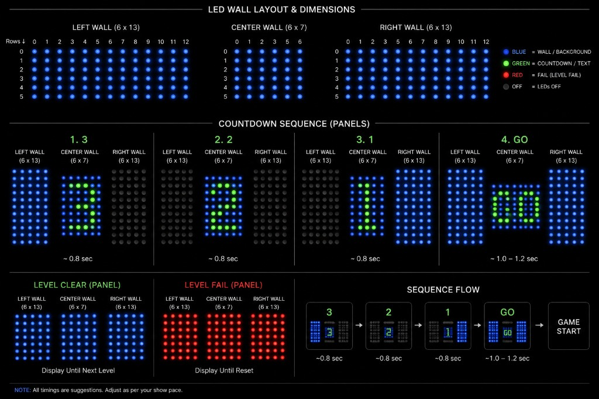

# LED Power Climb — effects spec

Audio, countdown, and LED wall behavior for **LED Power Climb**.

Global rules: [activerse_final_changes/docs/game-effects/GLOBAL_RULES.md](../../docs/game-effects/GLOBAL_RULES.md)

Matrix reference: [GRID_MATRICES.md](../../docs/game-effects/GRID_MATRICES.md)

---

## Wall layout (6 × 33)

The physical floor is one **6-row × 33-column** matrix, split into three wall
sections (left → center → right):

| Section | Size | Column range (within section) |
|---------|------|-------------------------------|
| **Left wall** | 6 × 13 | cols 0–12 |
| **Center wall** | 6 × 7 | cols 0–6 |
| **Right wall** | 6 × 13 | cols 0–12 |

Full matrix column map (0-based):

| Section | Global cols |
|---------|-------------|
| Left | 0–12 |
| Center | 13–19 |
| Right | 20–32 |

### Color legend

| Color | Meaning |
|-------|---------|
| **Blue** | Wall / background — LEDs **ON** |
| **Green** | Countdown digit or text |
| **Red** | Level fail |
| **Black / off** | LEDs **OFF** |

### Effects flow diagram

---

## Audio assets

| Asset | File / source |
|-------|---------------|
| **BGM** | TRON *End of Line* (`background_noise`) — level play only |
| **Positive score SFX** | Shared positive MP3 (cross-game) |
| **Negative score SFX** | Shared negative MP3 (cross-game) |
| **Countdown** | Tick/noise during 3-2-1; **no BGM** |
| **Level transition** | Short stinger ~2–3 s (asset TBD / stock OK) |

---

## Countdown (every level start)

Runs before **every level** — first level of the session, after level clear,
and after level fail restart. **Not** repeated when the session has ended.

Tick/noise audio; no BGM. Background **blue** shifts between walls during
the sequence (see diagram).

| Step | Duration | Left wall (6×13) | Center wall (6×7) | Right wall (6×13) |
|------|----------|------------------|-------------------|-------------------|
| **3** | ~0.8 s | Solid **blue** | **"3"** green on blue | **Off** |
| **2** | ~0.8 s | **Off** | **"2"** green on blue | **Off** |
| **1** | ~0.8 s | **Off** | **"1"** green on blue | Solid **blue** |
| **GO** | ~1.0–1.2 s | Solid **blue** | **"GO"** green on blue | Solid **blue** |

UI countdown and wall LEDs stay in sync. Then level play begins (BGM on).

Timings are suggestions — tune to show pace.

---

## Level clear

All three walls (left, center, right) → solid **blue**.

1. Hold clear pattern ~2–3 s with transition stinger (not BGM)
2. **Countdown** (3-2-1-GO sequence above)
3. **Next level** play begins

If more levels remain: clear → stinger → countdown → next level play.

---

## Timer expire (= session end)

Same LED treatment as **level clear** (all walls **blue**).

1. Hold clear pattern ~2–3 s with transition stinger (not BGM)
2. All LEDs **black / off**
3. **No countdown** — session is over

All three walls → solid **red**.

Triggered when **all lives are lost**.

1. Hold fail pattern ~2–3 s with transition stinger (not BGM)
2. **Countdown** (3-2-1-GO sequence above)
3. **Same level** restart play begins

---

## Reference media

Capture and timing reference: **`~/Downloads/Power Climb/`**

Use for LED pattern design only — not frontend video playback.
